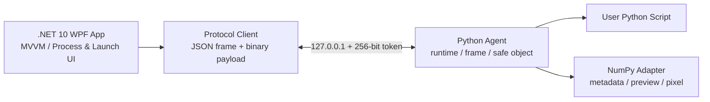

# PyRuntime Inspector

PyRuntime Inspector는 Windows에서 실행되는 사용자의 CPython 프로그램을 **읽기 전용으로 관찰**하는 데스크톱 도구입니다. 실행 중인 Python 런타임, 스레드와 프레임, locals/globals, 객체, 클래스와 메서드, NumPy 배열의 메타데이터와 이미지 preview를 안전하고 제한적으로 탐색하는 것이 목적입니다.

이 프로젝트는 외부 프로세스가 CPython 메모리 레이아웃을 직접 해석하지 않습니다. 대신 대상 Python 프로세스 안에서 경량 agent가 Python API로 객체를 해석하고, WPF controller와 인증된 loopback TCP로 통신합니다. 따라서 Python 버전별 비공개 객체 레이아웃에 덜 의존하며 property나 임의 사용자 코드를 실행하지 않는 안전한 Inspector를 만들 수 있습니다.

현재 **Phase 0~7**이 구현되어 있습니다.

- Phase 0: Python agent와 C# headless protocol POC
- Phase 1: WPF Runtime/Object/Class/Array Inspector
- Phase 2: WPF에서 Python 프로그램을 직접 시작하는 Managed Launch
- Phase 3: 실행 중인 CPython 3.14+ 프로세스에 `sys.remote_exec`로 Live Attach
- Phase 4: OS 메모리, `tracemalloc`, snapshot diff와 bounded timeline
- Phase 5: source tile, histogram, bool/int/float normalization과 고급 volume view
- Phase 6: CPython 3.12+ `sys.monitoring` 기반 bounded execution events
- Phase 7: portable ZIP, CPython 호환성·안정성 gate, Windows CI, WiX MSI와 Authenticode 서명 경로

## 핵심 원칙

- 읽기 전용 inspection
- 사용자가 소유하거나 검사 권한을 가진 로컬 프로세스만 대상
- 외부 네트워크가 아닌 `127.0.0.1` loopback만 사용
- 세션별 256-bit token 인증
- `pickle`, arbitrary `eval`, `exec`, 함수 호출 및 메모리 쓰기 금지
- arbitrary `repr`, `str`, `getattr`, `dir`, property 및 descriptor 실행 금지
- 전체 객체 그래프나 전체 대형 배열을 한 번에 전송하지 않음
- pagination, preview 크기, handle 수, TTL 및 요청 크기 제한
- Detach가 대상 Python 프로그램을 종료하지 않음

## 현재 아키텍처



### WPF App의 역할

- cooperative Attach listener 관리
- Managed Launch process 생성과 종료
- Python executable, script, argv, cwd 및 환경 변수 구성
- stdout/stderr 비동기 수집
- exit code와 process 상태 표시
- Runtime/Thread/Frame/Variable UI
- Object/Class 정적 Inspector
- NumPy WriteableBitmap 렌더링
- OS Private Bytes 조회
- Working Set/Private/Virtual/Peak 및 Python allocation timeline
- `tracemalloc` 제어, snapshot과 allocation diff
- 선택적 execution event와 path filter, bounded ring buffer

### Python Agent의 역할

- 정확한 Python version, executable 및 runtime 정보 제공
- thread와 frame snapshot 생성
- locals, globals, built-ins pagination
- 안전한 객체 preview와 bounded opaque handle 관리
- 클래스 dictionary와 MRO 기반 정적 멤버 분류
- 이미 로드된 NumPy의 exact `ndarray`만 검사
- bool/uint/int/float image·volume preview, source tile, histogram 및 정확한 원본 pixel 조회

## 지원 환경

현재 목표 환경:

- Windows 10/11 x64
- CPython 3.10~3.14 standard GIL build
- 로컬 컴퓨터
- 한 번에 하나의 inspector 연결
- NumPy는 선택 사항이며 대상에서 이미 import된 경우에만 adapter 활성화

자동 검증은 CPython 3.11/3.12와 NumPy 2.x를 사용하며, Live Attach는 공식 CPython 3.14.6 Windows x64 배포본에서 실제 검증했습니다.

초기 비지원 범위:

- PyPy
- free-threaded CPython
- subinterpreter와 embedded Python
- x86/ARM64
- 원격 컴퓨터 연결
- CUDA/GPU 메모리
- 변수 값 또는 대상 메모리 수정
- Python 3.10~3.13 무수정 live attach

## 가장 빠른 실행 방법

Release self-contained 실행 파일:

```text
artifacts\PyRuntimeInspector-0.1.0-win-x64\PyRuntimeInspector.exe
```

이 실행 파일은 .NET runtime을 함께 배포하는 self-contained 빌드입니다. 실행만 하는 컴퓨터에는 별도 .NET 10 runtime 설치가 필요하지 않습니다.

### 실행 중 Python에 Quick Attach

1. Process 목록에서 Python 프로세스를 선택합니다.
2. **Quick Attach**를 누릅니다.
3. CPython 3.14+는 자동 Live Attach됩니다. REPL이 `>>>`에서 입력을 기다리는 중이면 safe point 진입을 위해 Enter만 한 번 누릅니다.
4. CPython 3.10~3.13은 앱이 완성된 bootstrap 한 줄을 자동 복사합니다. 해당 REPL에서 `Ctrl+V`, Enter만 누릅니다.
5. 연결 직후 **Variables**에 `Modules / __main__`이 자동으로 열리므로 별도의 keep-alive loop 없이 선언한 전역 변수를 바로 확인합니다.

상세 동작과 보안 경계는 [Quick Attach](docs/quick-attach.md)를 참고합니다.

## CPython 3.14+ Live Attach

실행 중인 CPython 3.14 이상 프로세스는 대상 소스 수정이나 재시작 없이 연결할 수 있습니다.

1. 상단 Process 목록을 새로 고치고 대상을 선택합니다.
2. 필요하면 **Elevate live helper**를 켭니다. GUI 자체는 승격되지 않습니다.
3. 기본 **Quick Attach** 또는 고급 **Live**를 누릅니다.
4. helper는 선택한 프로세스의 실제 `python.exe`를 사용하므로 major/minor 버전이 일치합니다.
5. 대상이 다음 Python safe execution point에 도달하면 Agent가 역방향으로 연결합니다.

권한 부족, 이미 종료된 PID, 비활성화된 remote debugging과 helper 오류는 구조화된 오류로 표시됩니다. 다만 `sys.remote_exec()`가 예약된 뒤 대상이 blocking system call에서 Python safe point로 돌아오지 않으면 완료 여부를 알 수 없어 30초 후 timeout됩니다. Detach는 주입된 Agent 연결만 종료하며 대상 프로세스는 계속 실행됩니다.

아직 Release 결과물이 없다면 저장소 루트에서 다음을 실행합니다.

```powershell
dotnet build src\PyRuntimeInspector.App\PyRuntimeInspector.App.csproj -c Release
```

현재 개발 환경처럼 SDK가 사용자 전용 위치에 있다면 다음 형식도 사용할 수 있습니다.

```powershell
& "$HOME\.dotnet10\dotnet.exe" build src\PyRuntimeInspector.App\PyRuntimeInspector.App.csproj -c Release
```

## Managed Launch 사용법

Managed Launch는 사용자 스크립트에 `start_inspector()`를 추가하지 않고 WPF가 선택한 Python으로 agent와 스크립트를 함께 실행하는 권장 방식입니다.

1. `PyRuntimeInspector.App.exe`를 실행합니다.
2. **Managed Launch** 탭을 엽니다.
3. **Python**에 사용할 interpreter를 입력하거나 Browse로 선택합니다.
4. **Script**에서 실행할 `.py` 파일을 선택합니다.
5. 필요한 경우 **Arguments**, **Working directory**, 환경 변수를 설정합니다.
6. 상단 또는 탭 내부의 **Launch**를 누릅니다.
7. 연결되면 Runtime Tree에서 thread/frame/scope를 선택해 변수를 탐색합니다.
8. **PROCESS OUTPUT**에서 stdout과 stderr를 확인합니다.
9. 프로그램이 종료되면 실제 exit code가 표시됩니다.

### Python interpreter 선택

시스템 Python:

```text
C:\Python312\python.exe
```

venv:

```text
C:\work\project\.venv\Scripts\python.exe
```

Conda 환경:

```text
C:\Users\<user>\miniconda3\envs\my-env\python.exe
```

WPF는 선택한 executable을 그대로 실행하며 다른 Python으로 대체하지 않습니다. Runtime panel의 `Executable` 값으로 실제 interpreter를 확인할 수 있습니다.

### Arguments

Arguments 입력은 Windows command-line quoting 규칙을 사용합니다.

```text
--input "C:\images\sample image.png" --threshold 0.5 ""
```

위 값은 Python에서 다음과 같이 전달됩니다.

```python
sys.argv == [script_path, "--input", r"C:\images\sample image.png", "--threshold", "0.5", ""]
```

### Working directory와 환경 변수

- Working directory는 대상 프로세스의 실제 `os.getcwd()`가 됩니다.
- Environment overrides DataGrid에 추가한 값은 대상 프로세스에 전달됩니다.
- 동일한 이름이 여러 번 있으면 마지막 값이 사용됩니다.
- inspector가 관리하는 `PY_INSPECTOR_*`, `PYTHONPATH`, `PYTHONUNBUFFERED` 값은 안전한 연결과 실시간 출력을 위해 launcher가 최종 설정합니다.

### stdout, stderr 및 exit code

- stdout과 stderr는 별도 pipe로 비동기 수집됩니다.
- UI에서 `stdout`과 `stderr` label 및 색상으로 구분됩니다.
- 출력은 UI 메모리가 무한히 증가하지 않도록 최근 5,000줄로 제한됩니다.
- 사용자 스크립트의 `SystemExit(n)`과 정상/비정상 종료 code가 그대로 표시됩니다.
- stdout/stderr는 UTF-8, line 단위로 표시됩니다.

### Launch, Detach, Stop, Restart의 차이

| 명령 | Inspector 연결 | 대상 Python 프로세스 |
| --- | --- | --- |
| Launch | 새 세션 token으로 연결 | 새로 실행 |
| Detach | 연결 종료 | 계속 실행 |
| Stop | 연결 종료 | process tree 종료 |
| Restart | 기존 managed target 종료 | 동일 설정으로 다시 실행 |
| WPF 창 닫기 | 연결 종료 | 실행 중인 managed target 종료 |

## Cooperative Attach 사용법

기존 Phase 1 방식도 계속 지원합니다. 대상 코드에 다음을 추가합니다.

```python
from pyruntime_inspector_agent import start_inspector

start_inspector()
```

사용 순서:

1. WPF에서 Port와 Token을 확인합니다.
2. 고급 **Listen**을 눌러 `Waiting for cooperative target` 상태로 만듭니다.
3. **Copy environment**를 눌러 환경 변수 설정을 복사합니다.
4. 별도 PowerShell에서 복사한 내용을 실행합니다.
5. 대상 Python 프로그램을 시작합니다.

예시:

```powershell
$env:PY_INSPECTOR_HOST='127.0.0.1'
$env:PY_INSPECTOR_PORT='49152'
$env:PY_INSPECTOR_TOKEN='<64-character token>'
$env:PYTHONPATH='C:\Git\PyMonitor\agent'
python samples\target_sample.py
```

Process selector에서 PID를 선택하면 연결된 agent의 실제 PID가 선택한 값과 같은지 검증합니다. 이는 실행 중 프로세스에 agent를 주입하는 기능이 아닙니다.

## UI 구성

### Top Toolbar

- Python process selector
- PID, Python version, architecture
- Quick Attach, Listen, Live, Launch, Stop, Restart, Detach, Refresh
- Port와 token
- 연결 상태와 Safe Mode
- refresh interval과 Private Bytes

### Runtime Tree

- Process
- Interpreter
- Threads
- Frames
- Locals / Globals / Built-ins
- 이미 로드된 Modules와 `__main__` namespace
- Classes 및 GC-tracked objects의 현재 단계 안내

### Variables

- Name, Scope, Type
- Safe Preview
- Shape와 DType
- Shallow/Payload size
- Object address
- Changed와 Expandable
- 검색, pagination, recycling virtualization

### Object Inspector와 Class & Methods

- instance dictionary와 class static members
- property를 실행하지 않는 정적 검사
- instance method, staticmethod, classmethod, property, descriptor 분류
- annotation을 평가하지 않는 bounded signature 표시

### Array / Image

- 2D Gray8
- HWC/CHW RGB 및 RGBA
- RGB/BGR 해석
- channel on/off
- 3D volume slice
- Fit, 1:1, nearest-neighbor zoom, pan
- 고배율 pixel grid
- 원본 좌표와 정확한 dtype 값
- object address와 data buffer address 구분

## Managed Launch 내부 동작

WPF launcher는 선택한 interpreter에 다음 module을 전달합니다.

```text
python -m pyruntime_inspector_agent.managed_launch <script> <args...>
```

wrapper는 다음 순서로 동작합니다.

1. 사용자 script의 절대 경로를 확인합니다.
2. `sys.argv[0]`를 사용자 script로 복원합니다.
3. `sys.path[0]`를 사용자 script directory로 설정합니다.
4. inspector agent를 daemon thread에서 시작합니다.
5. `runpy.run_path(script, run_name="__main__")`로 사용자 코드를 실행합니다.
6. 사용자의 `SystemExit`, 예외 및 exit code를 launcher로 전파합니다.

`start_inspector()`는 한 프로세스에서 idempotent하므로 사용자 코드가 cooperative 호출을 포함해도 agent가 중복 생성되지 않습니다.

## 프로토콜과 보안

모든 frame:

1. 4-byte unsigned big-endian JSON header length
2. UTF-8 JSON header
3. `binaryLength`에 지정된 optional binary payload

주요 제한:

- JSON header: 최대 1 MiB
- binary payload: 최대 8 MiB
- collection page: 기본 100, 최대 1,000
- array preview: 최대 1024×1024
- token 인증 전 inspection 금지
- 잘못된 token은 연결 종료
- token은 agent/controller log에 기록하지 않음
- object handle은 session-scoped UUID, TTL 및 LRU 제한

자세한 내용:

- [Architecture](docs/architecture.md)
- [Protocol](docs/protocol.md)
- [Security](docs/security.md)
- [Limitations](docs/limitations.md)
- [Phase 1 UI](docs/phase1-ui.md)
- [Phase 3 Live Attach](docs/phase3-live-attach.md)
- [Phase 4 Memory](docs/phase4-memory.md)
- [Phase 5 Advanced Arrays](docs/phase5-arrays.md)
- [Phase 6 Execution Monitoring](docs/phase6-execution-monitoring.md)
- [Phase 7 Release Hardening](docs/release.md)
- [Quick Attach and REPL Globals](docs/quick-attach.md)

## 프로젝트 구조

```text
src/
  PyRuntimeInspector.Protocol/   # C# frame protocol과 request client
  PyRuntimeInspector.Cli/        # Phase 0 headless controller
  PyRuntimeInspector.App/        # .NET 10 WPF/MVVM application

agent/
  pyruntime_inspector_agent/
    server.py                    # agent connection 및 method dispatch
    managed_launch.py            # Phase 2 user script wrapper
    runtime_info.py              # Python runtime metadata
    frames.py                    # thread/frame/scope snapshots
    handles.py                   # bounded opaque handle store
    safe_objects.py              # side-effect-free object summaries
    classes.py                   # static class/member inspection
    arrays.py                    # NumPy preview/tile/histogram/pixel adapter
    memory.py                    # tracemalloc status/snapshots/diff
    monitoring.py                # bounded sys.monitoring event ring

tests/
  agent_tests/                   # Python unit tests
  PyRuntimeInspector.Protocol.Tests/
  PyRuntimeInspector.IntegrationTests/
  PyRuntimeInspector.App.Tests/  # WPF ViewModel + actual managed subprocess

samples/
  target_sample.py               # cooperative attach sample
  target_managed.py              # managed launch contract sample
  target_stability.py            # release stability target

scripts/
  Build-PortableRelease.ps1      # self-contained directory, ZIP, SHA-256
  Invoke-StabilityTests.ps1      # duration/load/repeated detach gate
  Build-Installer.ps1            # WiX x64 MSI and SHA-256
  Build-Release.ps1              # optional Authenticode signed release
```

## 빌드와 테스트

전체 .NET 테스트:

```powershell
dotnet test PyRuntimeInspector.slnx -c Release
```

Python agent 테스트:

```powershell
$env:PYTHONPATH=(Resolve-Path agent).Path
python -m unittest discover -s tests\agent_tests -v
```

Portable ZIP과 MSI까지 포함한 unsigned release build:

```powershell
.\scripts\Build-PortableRelease.ps1
.\scripts\Build-Installer.ps1
```

CPython 3.10~3.14 matrix와 60초 안정성 gate:

```powershell
.\scripts\Test-PythonMatrix.ps1
.\scripts\Invoke-StabilityTests.ps1 -DurationSeconds 60 -Cycles 10
```

검증 범위에는 다음이 포함됩니다.

- protocol framing과 payload 제한
- token 인증 실패
- property 및 위험한 `__repr__` 미실행
- bounded handle의 10,000회 inspect/release
- HWC/CHW/BGR/channel/volume preview
- UI Attach 비차단
- 빠른 선택 변경의 stale-response 차단
- target 종료 처리
- Managed Launch command와 Detach/Stop 의미
- 실제 Python subprocess의 interpreter, argv, cwd, env
- stdout/stderr와 exit code
- CPython 3.14 실제 프로세스 Live Attach와 Detach 후 대상 생존
- CPython 3.11 idle REPL one-paste Quick Attach와 `__main__` 변수 자동 표시
- CPython 3.14 one-click Quick Attach와 `__main__` namespace 표시
- tracemalloc start/stop, bounded snapshot, allocation diff와 timeline
- uint16/int/float/bool normalization, NaN/Inf, label map, tile와 histogram
- Python 3.12+ execution events, tool ID 충돌과 bounded drop 처리
- publish 폴더의 Agent·샘플·문서 포함, 버전 일치와 개발 artifact 제외
- CPython 3.10~3.14 Agent test matrix
- 대형 배열, monitoring 부하, 반복 Detach, 장시간 요청과 working-set 상한
- portable ZIP과 MSI의 SHA-256 생성

## 제한과 주의 사항

- snapshot은 stop-the-world가 아니며 수집 직후 stale할 수 있습니다.
- identity token으로 name binding 변경은 감지하지만 mutable object 내부 변경 전체를 감지하지는 않습니다.
- shallow size는 참조 객체와 native allocation을 포함하지 않습니다.
- NumPy payload는 `nbytes`이며 object header와 분리됩니다.
- 대형 배열 전체 checksum 또는 전체 원본 전송은 수행하지 않습니다.
- Managed Launch 창을 닫으면 orphan process와 redirect pipe 문제를 방지하기 위해 managed target도 종료합니다.
- 사용자가 직접 Detach한 경우에는 대상이 계속 실행됩니다.
- Python 3.10~3.13은 안전한 무수정 주입 API가 없어 Quick Attach가 복사한 한 줄을 대상 REPL에 한 번 붙여넣어야 합니다.
- `tracemalloc`은 시작 이후의 Python allocator 블록만 추적하며 native/GPU 메모리를 포함하지 않습니다.
- array preview와 tile은 최대 1024×1024이며 histogram은 최대 1,000,000개 sampled element를 사용합니다.
- execution monitoring은 Python 3.12+ 전용이며 활성 이벤트 수에 따라 대상 CPU overhead가 증가합니다.

## 로드맵

- 다음 기능 후보: GC-tracked objects의 제한적 검색·pagination 화면
- 추가 플랫폼 후보: free-threaded CPython, ARM64, GPU 메모리 adapter
