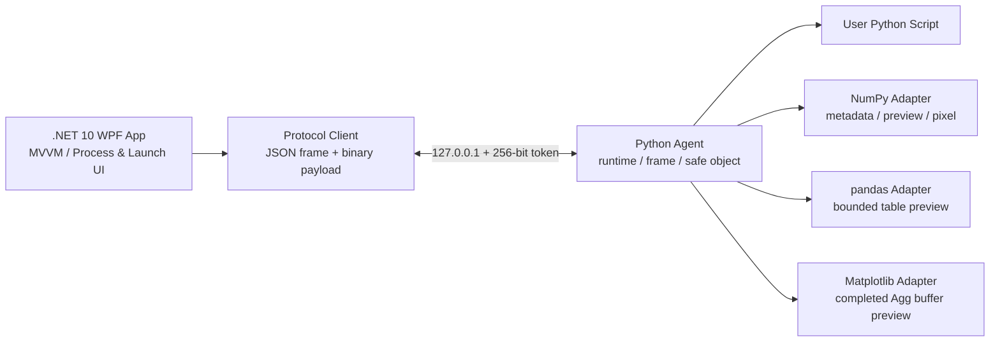

# PyMonitor

PyMonitor는 Windows에서 실행되는 사용자의 CPython 프로그램을 **읽기 전용으로 관찰**하는 데스크톱 도구입니다. 실행 중인 Python 런타임, 스레드와 프레임, locals/globals, 객체, 클래스와 메서드, NumPy 배열의 메타데이터·이미지 preview, pandas DataFrame 표와 Matplotlib Figure/Axes render를 안전하고 제한적으로 탐색하는 것이 목적입니다.

- 버전: `26.7.11`
- 개발자: 박영문

이 프로젝트는 외부 프로세스가 CPython 메모리 레이아웃을 직접 해석하지 않습니다. 대신 대상 Python 프로세스 안에서 경량 agent가 Python API로 객체를 해석하고, WPF controller와 인증된 loopback TCP로 통신합니다. 따라서 Python 버전별 비공개 객체 레이아웃에 덜 의존하며 property나 임의 사용자 코드를 실행하지 않는 안전한 Inspector를 만들 수 있습니다.

## 주요 기능 한눈에 보기

| 하고 싶은 일 | PyMonitor에서 할 수 있는 일 |
| --- | --- |
| 변수 찾기 | frame의 locals/globals, module namespace와 GC-tracked object를 이름·타입·값으로 검색하고 필터링 |
| 객체 안쪽 탐색 | 선택한 변수에서 시작해 collection, mapping, instance field를 Object Tree로 이동하고 class, MRO, method와 parameter를 정적으로 확인 |
| 데이터 확인 | NumPy 배열과 OpenCV 이미지 preview·pixel·histogram, pandas DataFrame 표, Matplotlib Figure/Axes render 확인 |
| 실행 중 변화 추적 | 같은 scope의 직전 snapshot과 비교해 Added, Removed, Rebound, Updated 상태를 최소 10초 동안 강조 |
| 자원과 실행 흐름 확인 | process memory, `tracemalloc` snapshot/diff, CPython 3.12+ execution event를 제한된 기록으로 확인 |
| Python에 연결 | 직접 실행하는 Managed Launch, 실행 중인 프로세스의 Quick Attach, 코드에서 시작하는 Cooperative Attach 지원 |

모든 inspection은 읽기 전용입니다. PyMonitor는 변수 값을 수정하거나 함수,
property 또는 임의 사용자 코드를 실행하는 debugger가 아닙니다. 각 기능의 제한과
보안 경계는 이 README의 상세 설명과 [Security](docs/security.md)를 참고합니다.

## 설치 및 제거

### 배포 파일 선택

| 배포 파일 | 권장 용도 | 설치 결과 |
| --- | --- | --- |
| `PyMonitor-26.7.11-win-x64.msi` | 일반 사용자에게 권장 | 관리자 승인을 받아 64비트 Program Files에 설치하고 시작 메뉴에 PyMonitor 바로가기를 등록 |
| `PyMonitor-26.7.11-win-x64.zip` | 설치 권한이 없거나 여러 버전을 나란히 시험할 때 | 원하는 폴더에 압축을 풀고 `PyMonitor.exe`를 직접 실행하며 Windows 설치 목록에는 등록하지 않음 |

두 방식 모두 Windows 10/11 x64용이며 .NET runtime을 포함한 self-contained
배포입니다. 따라서 실행 PC에 별도 .NET 10 runtime을 설치할 필요가 없고 Python
Agent도 배포 폴더에 포함되므로 별도의 `pip install`이 필요하지 않습니다.

다만 **관찰하거나 Managed Launch로 실행할 대상 CPython 3.10~3.14 x64
standard-GIL interpreter는 해당 PC에 별도로 설치되어 있어야 합니다.** 사용자의
스크립트가 NumPy, pandas, Matplotlib, OpenCV 같은 package를 사용한다면 그
package도 PyMonitor가 아니라 **대상 Python 또는 대상 venv/Conda 환경**에 별도로
설치해야 합니다. PyMonitor는 사용자의 Python과 package를 대신 배포하지 않습니다.

### 무결성 확인과 설치

MSI 또는 ZIP과 같은 이름의 `.sha256` 파일을 함께 받은 뒤 PowerShell에서 다음처럼
비교합니다. 마지막 결과가 `True`여야 하며, hash가 맞더라도 신뢰할 수 있는
배포처에서 받은 파일인지 별도로 확인해야 합니다.

```powershell
$file = '.\PyMonitor-26.7.11-win-x64.msi' # ZIP이면 .zip으로 변경
$actual = (Get-FileHash -LiteralPath $file -Algorithm SHA256).Hash.ToLowerInvariant()
$expected = (Get-Content -LiteralPath "$file.sha256" -Raw).Split()[0]
$actual -eq $expected
```

MSI는 파일을 두 번 클릭하고 Windows의 관리자 승인 절차를 따른 뒤 시작 메뉴에서
**PyMonitor**를 실행합니다. 저장소의 기본 `unsigned` 빌드는 Authenticode 서명이
없어 Windows가 알 수 없는 게시자 경고를 표시할 수 있습니다. 출처와 SHA-256을
확인할 수 없을 때는 경고를 우회하지 마십시오.

Portable ZIP은 Windows의 **압축 풀기**로 새 폴더에 완전히 푼 다음 그 안의
`PyMonitor.exe`를 실행합니다. `agent`, `samples`, `docs` 폴더는 실행 파일과 함께
유지해야 하며 ZIP 내부에서 직접 실행하지 않습니다.

### 업데이트 확인 및 설치

공식 GitHub Release에서 빌드한 PyMonitor는 프로그램 시작 후 마지막 자동 확인에서
24시간이 지났을 때 **최신 안정 Release를 한 번 조용히 확인**합니다. 최신 버전이
없거나 인터넷 연결·GitHub 응답에 문제가 있으면 작업을 방해하는 창을 표시하지
않습니다. 즉시 다시 확인하려면 **About > Check for updates**를 사용합니다.

새 버전이 발견되어도 자동으로 다운로드하거나 설치하지 않습니다. 사용자가 버전과
설치 방식 전환 안내를 확인하고 승인한 뒤에만 다음 순서로 진행합니다.

1. Release에서 정확히 일치하는
   `PyMonitor-<version>-win-x64.msi`와
   `PyMonitor-<version>-win-x64.msi.sha256` 두 파일을 다운로드합니다.
2. sidecar의 파일명과 SHA-256이 MSI와 일치하는지 확인하고 Windows Authenticode
   서명이 신뢰되는지도 검증합니다. 하나라도 실패하면 설치 파일을 실행하지 않습니다.
3. 검증에 성공하면 Windows UAC 승인을 요청하고 MSI major upgrade를 실행합니다.
   더 낮은 버전으로의 downgrade는 차단됩니다.

이 자동 확인은 빌드할 때 유효한 `GitHubRepository` assembly metadata가 주입된 공식
빌드에서만 활성화됩니다. repository metadata가 없는 로컬 개발 빌드는 네트워크 자동
확인을 하지 않습니다. 최종 사용자에게 배포할 Release 저장소는 공개되어야 합니다.
비공개 저장소의 인증 토큰을 프로그램에 내장하지 않으므로 private GitHub Release는
일반 사용자용 인앱 업데이트 원본으로 지원하지 않습니다.

Portable ZIP에서 업데이트 설치를 승인하면 기존 폴더를 덮어쓰는 portable 갱신이
아니라 **Windows MSI 설치 방식으로 전환**됩니다. 설치가 끝난 뒤 시작 메뉴의
PyMonitor가 정상 실행되는지 확인하고 기존 portable 폴더는 직접 삭제할 수 있습니다.
Portable 방식을 계속 유지하려면 새 ZIP과 `.sha256`을 직접 받아 새 폴더에 풀고,
실행을 확인한 뒤 이전 폴더를 삭제하십시오.

### 제거

- MSI 제거: Windows **설정 > 앱 > 설치된 앱 > PyMonitor > 제거**를 사용합니다.
  설치 파일과 시작 메뉴 바로가기는 제거되지만 대상 Python과 사용자 package에는
  영향을 주지 않습니다.
- Portable 제거: PyMonitor를 종료한 뒤 압축을 풀었던 폴더만 삭제합니다.
- 두 방식 모두 테마와 창 배치 같은 사용자 설정은
  `%LOCALAPPDATA%\PyMonitor\settings.json`에 별도로 남습니다. 설정까지 초기화하려면
  PyMonitor를 종료한 뒤 `%LOCALAPPDATA%\PyMonitor` 폴더를 직접 삭제합니다.

## 5분 빠른 시작

다음 순서는 별도 sample package 없이 `cmd.exe`의 Python REPL 변수를 확인하는 가장
짧은 예입니다.

1. `cmd.exe`에서 대상 Python을 실행하고 PID와 예제 변수를 만듭니다.

   ```python
   python
   >>> import os
   >>> os.getpid()
   12345
   >>> example_value = 1235
   >>> example_items = {"name": "PyMonitor", "values": [1, 2, 3]}
   ```

2. PyMonitor를 실행하고 상단 **Rescan**을 누른 뒤 방금 확인한 PID의
   `python.exe`를 선택하고 **Quick Attach**를 누릅니다.
3. CPython 3.14+에서는 연결 요청 후 REPL이 `>>>`에서 기다리고 있다면 Enter를 한
   번 눌러 safe point에 진입합니다. CPython 3.10~3.13에서는 PyMonitor가 복사한
   bootstrap 한 줄을 같은 REPL에 `Ctrl+V`로 붙여넣고 Enter를 누릅니다.
4. 연결되면 **Inspect > Runtime > Modules > `__main__`**에서
   `example_value` 또는 `example_items`를 선택합니다. 오른쪽 Overview, Object Tree,
   Class and Methods가 같은 선택을 상세 표시합니다.
5. REPL에서 `example_value = 5678`로 바꾸고 PyMonitor에서 `F5`를 누릅니다. 변경된
   행이 강조되며 Variables 검색은 `Ctrl+F`로 바로 시작할 수 있습니다.

사용할 `.py` 파일이 있다면 **Launch** 탭에서 대상 Python과 script를 선택해
**Launch**를 누르는 Managed Launch가 더 간단합니다. 배포본의 `samples` 폴더에는
연결 방식과 데이터 inspection을 시험할 예제가 포함되어 있습니다. 상세 연결 방법과
문제 해결은 아래 [연결 방식 상세](#연결-방식-상세)와
[Quick Attach 문서](docs/quick-attach.md)를 참고합니다.

## F1 검색 도움말

메인 창 어디서든 `F1`을 누르거나 상단 **Help** 버튼을 누르면 modeless
**PyMonitor Help** 창이 열립니다. 도움말을 연 상태에서도 메인 창을 계속 사용할 수
있고, 다시 `F1` 또는 **Help**를 실행하면 새 창을 만들지 않고 기존 도움말 창을
활성화한 뒤 검색란에 focus합니다.

검색란에 `Quick Attach`, `DataFrame`, `변경 강조` 같은 한글·영문 키워드를
입력하면 제목, 키워드, 요약, 상세 설명, 따라하기 단계, 예제 전체에서 실시간으로
찾습니다. 대소문자를 구분하지 않으며 공백으로 나눈 여러 단어를 모두 포함하는
항목만 표시합니다. 결과를 선택하면 오른쪽에 상세 설명, 순서별 따라하기, 코드 예제와
주의사항이 함께 표시됩니다. 검색어를 지우면 전체 도움말 주제로 돌아갑니다.

`Ctrl+F`는 현재 포커스에 따라 동작합니다. 메인 창에서는 기존처럼 **Variables
검색**으로 이동하고, PyMonitor Help 창에서는 도움말 검색란으로 이동합니다.

## 핵심 원칙

- 읽기 전용 inspection
- 사용자가 소유하거나 검사 권한을 가진 로컬 프로세스만 대상
- 외부 네트워크가 아닌 `127.0.0.1` loopback만 사용
- 세션별 256-bit token 인증
- `pickle`, arbitrary `eval`, `exec`, 함수 호출 및 메모리 쓰기 금지
- arbitrary `repr`, `str`, `getattr`, `dir`, property 및 descriptor 실행 금지
- 전체 객체 그래프나 전체 대형 배열을 한 번에 전송하지 않음
- pagination, preview 크기, handle 수, TTL 및 요청 크기 제한
- Detach가 대상 Python 프로그램을 종료하지 않음

## 현재 아키텍처



### WPF App의 역할

- cooperative Attach listener 관리
- Managed Launch process 생성과 종료
- Python executable, script, argv, cwd 및 환경 변수 구성
- stdout/stderr 비동기 수집
- exit code와 process 상태 표시
- Runtime/Thread/Frame/Variable UI
- Object/Class 정적 Inspector
- NumPy WriteableBitmap 렌더링
- pandas DataFrame virtualized table 렌더링
- Matplotlib Figure/Axes의 bounded BGRA32 preview 렌더링
- OS Private Bytes 조회
- Working Set/Private/Virtual/Peak 및 Python allocation timeline
- `tracemalloc` 제어, snapshot과 allocation diff
- 선택적 execution event와 path filter, bounded ring buffer
- 명시적 GC-tracked object scan, 서버 검색과 pagination

### Python Agent의 역할

- 정확한 Python version, executable 및 runtime 정보 제공
- thread와 frame snapshot 생성
- locals, globals, built-ins pagination
- 안전한 객체 preview와 bounded opaque handle 관리
- 클래스 dictionary와 MRO 기반 정적 멤버 분류
- 이미 로드된 NumPy의 exact `ndarray`만 검사
- bool/uint/int/float image·volume preview, source tile, histogram 및 정확한 원본 pixel 조회
- 이미 로드된 pandas의 exact `DataFrame` metadata와 bounded 표 preview
- 이미 로드된 Matplotlib의 exact regular `Figure`/`Axes`와 완료된 Agg buffer preview
- `gc.get_objects()`의 bounded snapshot과 타입·모듈·주소 검색

## 지원 환경

현재 목표 환경:

- Windows 10/11 x64
- CPython 3.10~3.14 standard GIL build
- 로컬 컴퓨터
- 한 번에 하나의 inspector 연결
- NumPy는 선택 사항이며 대상에서 이미 import된 경우에만 adapter 활성화
- pandas는 선택 사항이며 대상에서 이미 import된 경우에만 DataFrame adapter 활성화
- Matplotlib은 선택 사항이며 대상에서 이미 import되고 Figure가 draw된 경우에만 render adapter 활성화

Agent suite 99개는 CPython 3.10.18, 3.11.9, 3.12.9, 3.13.7,
3.14.0rc2에서 NumPy·pandas·Matplotlib을 함께 설치한 상태로 통과했습니다
(런타임별 비지원 기능은 예상대로 skip). .NET Release suite는 App 123개,
Protocol 5개, Integration 2개로 총 130개가 통과했습니다. VS Code
debugpy breakpoint 연결은 CPython 3.12에서 DataFrame/Object Tree와 OpenCV
gradient·rectangle·text·gray·mask 변경까지 실제 검증했으며, Live Attach는
로컬 CPython 3.14.0rc2 Windows x64 런타임에서 검증했습니다.

초기 비지원 범위:

- PyPy
- free-threaded CPython
- subinterpreter와 embedded Python
- x86/ARM64
- 원격 컴퓨터 연결
- CUDA/GPU 메모리
- 변수 값 또는 대상 메모리 수정
- Python 3.10~3.13 무수정 live attach

## 연결 방식 상세

### 실행 중 Python에 Quick Attach

1. Process 목록에서 Python 프로세스를 선택합니다.
2. **Quick Attach**를 누릅니다.
3. CPython 3.14+는 자동 Live Attach됩니다. REPL이 `>>>`에서 입력을 기다리는 중이면 safe point 진입을 위해 Enter만 한 번 누릅니다.
4. CPython 3.10~3.13은 앱이 완성된 bootstrap 한 줄을 자동 복사합니다. 해당 REPL에서 `Ctrl+V`, Enter만 누릅니다.
5. 연결 직후 **Inspect**의 Variables에 `Modules / __main__`이 자동으로 열리므로 별도의 keep-alive loop 없이 선언한 전역 변수를 바로 확인합니다.

`cmd.exe`에서 단순히 `python`을 실행하고 `value = 1235`처럼 변수를 선언한
것만으로는 PyMonitor가 그 변수를 읽을 수 없습니다. Process 목록에
`python.exe`가 보이는 것과 Agent가 연결된 것은 별개입니다. 먼저 위의
**Quick Attach**를 수행해야 하며, 3.10~3.13에서는 복사된 bootstrap을 그
Python REPL의 `>>>` 프롬프트에 한 번 붙여넣어 실행해야 합니다. 연결 후
선언하거나 변경한 전역 변수는 `__main__` snapshot을 새로 고칠 때 표시됩니다.

이전에 연결한 Agent가 같은 Python debuggee의 `sys.modules`에 남아 있으면 새
Quick Attach는 이를 재사용하지 않습니다. Agent version·bootstrap ABI·경로와
전체 package module tree를 검사하고 `STALE_AGENT`, `INCOMPATIBLE_AGENT` 또는
`ACTIVE_AGENT_CONFLICT`를 즉시 표시합니다. stale/incompatible 상태에서는
PyMonitor만 다시 실행하지 말고 Python debuggee를 완전히 종료·재시작한 뒤 다시
연결합니다. active conflict는 기존 PyMonitor 세션을 Detach하거나 debuggee를
재시작해 해소합니다.

상세 동작과 보안 경계는 [Quick Attach](docs/quick-attach.md)를 참고합니다.

## CPython 3.14+ Live Attach

실행 중인 CPython 3.14 이상 프로세스는 대상 소스 수정이나 재시작 없이 연결할 수 있습니다.

1. 상단 Process 목록을 새로 고치고 대상을 선택합니다.
2. 필요하면 **Elevate live helper**를 켭니다. GUI 자체는 승격되지 않습니다.
3. 기본 **Quick Attach** 또는 고급 **Live**를 누릅니다.
4. helper는 선택한 프로세스의 실제 `python.exe`를 사용하므로 major/minor 버전이 일치합니다.
5. 대상이 다음 Python safe execution point에 도달하면 Agent가 역방향으로 연결합니다.

권한 부족, 이미 종료된 PID, 비활성화된 remote debugging과 helper 오류는 구조화된 오류로 표시됩니다. 다만 `sys.remote_exec()`가 예약된 뒤 대상이 blocking system call에서 Python safe point로 돌아오지 않으면 완료 여부를 알 수 없어 30초 후 timeout됩니다. Detach는 주입된 Agent 연결만 종료하며 대상 프로세스는 계속 실행됩니다.

아직 Release 결과물이 없다면 저장소 루트에서 다음을 실행합니다.

```powershell
dotnet build src\PyRuntimeInspector.App\PyRuntimeInspector.App.csproj -c Release
```

현재 개발 환경처럼 SDK가 사용자 전용 위치에 있다면 다음 형식도 사용할 수 있습니다.

```powershell
& "$HOME\.dotnet10\dotnet.exe" build src\PyRuntimeInspector.App\PyRuntimeInspector.App.csproj -c Release
```

## Managed Launch 사용법

Managed Launch는 사용자 스크립트에 `start_inspector()`를 추가하지 않고 WPF가 선택한 Python으로 agent와 스크립트를 함께 실행하는 권장 방식입니다.

1. `PyMonitor.exe`를 실행합니다.
2. **Launch** 탭을 엽니다.
3. **Python**에 사용할 interpreter를 입력하거나 Browse로 선택합니다.
4. **Script**에서 실행할 `.py` 파일을 선택합니다.
5. 필요한 경우 **Arguments**, **Working directory**, 환경 변수를 설정합니다.
6. 탭의 **Launch**를 누릅니다.
7. 연결되면 Runtime Tree에서 thread/frame/scope를 선택해 변수를 탐색합니다.
8. **PROCESS OUTPUT**에서 stdout과 stderr를 확인합니다.
9. 프로그램이 종료되면 실제 exit code가 표시됩니다.

### Python interpreter 선택

시스템 Python:

```text
C:\Python312\python.exe
```

venv:

```text
C:\work\project\.venv\Scripts\python.exe
```

Conda 환경:

```text
C:\Users\<user>\miniconda3\envs\my-env\python.exe
```

WPF는 선택한 executable을 그대로 실행하며 다른 Python으로 대체하지 않습니다. Runtime panel의 `Executable` 값으로 실제 interpreter를 확인할 수 있습니다.

### Arguments

Arguments 입력은 Windows command-line quoting 규칙을 사용합니다.

```text
--input "C:\images\sample image.png" --threshold 0.5 ""
```

위 값은 Python에서 다음과 같이 전달됩니다.

```python
sys.argv == [script_path, "--input", r"C:\images\sample image.png", "--threshold", "0.5", ""]
```

### Working directory와 환경 변수

- Working directory는 대상 프로세스의 실제 `os.getcwd()`가 됩니다.
- Environment overrides DataGrid에 추가한 값은 대상 프로세스에 전달됩니다.
- 동일한 이름이 여러 번 있으면 마지막 값이 사용됩니다.
- inspector가 관리하는 `PY_INSPECTOR_*`, `PYTHONPATH`, `PYTHONUNBUFFERED` 값은 안전한 연결과 실시간 출력을 위해 launcher가 최종 설정합니다.

### stdout, stderr 및 exit code

- stdout과 stderr는 별도 pipe로 비동기 수집됩니다.
- UI에서 `stdout`과 `stderr` label 및 색상으로 구분됩니다.
- 출력은 UI 메모리가 무한히 증가하지 않도록 최근 5,000줄로 제한됩니다.
- 사용자 스크립트의 `SystemExit(n)`과 정상/비정상 종료 code가 그대로 표시됩니다.
- stdout/stderr는 UTF-8, line 단위로 표시됩니다.

### Launch, Detach, Stop, Restart의 차이

| 명령 | Inspector 연결 | 대상 Python 프로세스 |
| --- | --- | --- |
| Launch | 새 세션 token으로 연결 | 새로 실행 |
| Detach | 연결 종료 | 계속 실행 |
| Stop | 연결 종료 | process tree 종료 |
| Restart | 기존 managed target 종료 | 동일 설정으로 다시 실행 |
| WPF 창 닫기 | 연결 종료 | 실행 중인 managed target 종료 |

## Cooperative Attach 사용법

기존 Phase 1 방식도 계속 지원합니다. 대상 코드에 다음을 추가합니다.

```python
from pyruntime_inspector_agent import start_inspector

start_inspector()
example_value = 1235
input("PyMonitor에서 확인한 뒤 Enter를 눌러 종료하세요...")
```

사용 순서:

1. WPF에서 Port와 Token을 확인합니다.
2. 고급 **Start listener**를 눌러 `Waiting for cooperative target` 상태로 만듭니다.
3. **Copy environment**를 눌러 환경 변수 설정을 복사합니다.
4. 별도 PowerShell에서 복사한 내용을 실행합니다.
5. 대상 Python 프로그램을 시작합니다.

**Copy environment**는 현재 MSI 설치 또는 Portable 압축 해제 위치를 찾아 실제
`agent` 경로를 복사합니다. 아래 값은 형식 예시이므로 실행할 때는 버튼이 복사한
값을 그대로 사용합니다.

```powershell
$env:PY_INSPECTOR_HOST='127.0.0.1'
$env:PY_INSPECTOR_PORT='49152'
$env:PY_INSPECTOR_TOKEN='<64-character token>'
$env:PYTHONPATH='<PyMonitor 설치 또는 압축 해제 폴더>\agent'
python cooperative_demo.py
```

함께 제공되는 `samples\target_sample.py`로 배열 기능까지 실습하려면 대상 Python에
NumPy가 설치되어 있어야 합니다.

Process selector에서 PID를 선택하면 연결된 agent의 실제 PID가 선택한 값과 같은지 검증합니다. 이는 실행 중 프로세스에 agent를 주입하는 기능이 아닙니다.

## UI 구성

PyMonitor의 기본 정보 구조는 `Inspect`, `Launch`, `Memory`, `Events` 네 탭입니다.
상단에는 Process 선택과 **Rescan**, **Quick Attach**, **Refresh**, **Detach**,
**About** 같은 주 동작만 배치하고, listener·Live Attach·환경 복사·자동 새로
고침·테마는 Advanced 영역에 모읍니다. 연결 중에는 read-only 상태와 PID,
Python 버전, architecture, private memory, 요청 latency를 한곳에서 확인합니다.

### Inspect: 선택 중심 master-detail workflow

Inspect는 `Runtime Tree / Pinned objects` → `Variables` → `Selected object` 순서로
연결됩니다. Runtime Tree에서 frame scope, 이미 로드된 module namespace 또는
GC-tracked objects를 고르고 Variables에서 한 행을 선택하면, 오른쪽의 같은
선택 컨텍스트를 다음 뷰가 함께 사용합니다.

- **Overview**: 안전한 preview, type/module/qualified name, address, shallow/payload
  size와 선택 경로, immediate child 이름 검색
- **Object Tree**: collection item, mapping value, instance field를 그룹화한
  지연 로딩 트리와 이미 로드된 이름 검색
- **Class and Methods**: class 개요, base class, MRO, instance field, method와
  class attribute를 구조화한 트리
- **DataFrame**: 선택이 exact pandas DataFrame일 때만 활성화되는 dtype 정보와
  인덱스 포함 표 preview, 행·열 단위 bounded pagination
- **Matplotlib**: 선택이 exact regular Figure/Axes일 때 완료된 Agg render를
  표시하는 bounded BGRA32 preview
- **Array and Image**: 선택이 exact NumPy ndarray일 때만 활성화되는 metadata,
  preview, tile, histogram과 pixel 검사

변수를 선택하면 DataFrame, Matplotlib 또는 Array adapter가 일치하는 경우 해당
전용 탭이 자동으로 열리고, 일반 객체는 Overview에서 시작합니다. Variables의
**Name**은 강조되어 있으며 표시된 값은 우클릭해 단일 값을 복사하고,
표 cell은 선택 cell 복사도 사용할 수 있습니다.

자동 새로 고침은 Variables 행을 제자리에서 갱신하므로 선택과 scroll 위치를
유지하고, background snapshot마다 loading overlay를 표시하거나 표 전체를 다시
만들지 않습니다. 선택한 NumPy/OpenCV 배열, DataFrame과 Matplotlib preview도
같은 주기에 현재 page·slice·layout 또는 마지막 정상 render를 유지한 채 다시
읽습니다.

Object Tree는 한 번에 100개 child를 읽고 **Load more**로 다음 페이지를
요청합니다. 동일 객체가 조상에 다시 나타나면 cycle로 표시하고 확장을
중단하며, UI 탐색은 선택 루트에서 최대 8단계로 제한합니다. 트리 항목을
선택해 더 깊은 객체를 현재 컨텍스트로 열 수 있습니다. 선택 헤더는 루트부터
현재 객체까지의 클릭 가능한 breadcrumb, 현재 depth, history 위치를 항상
표시합니다. 따라서 **Back / Forward / Parent**뿐 아니라 원하는 조상으로 바로
돌아갈 수 있고 path와 address도 복사할 수 있습니다. 중요한 객체는 현재 연결
세션 동안 pin하여 Pinned objects에서 다시 열 수 있습니다.

Overview의 검색은 현재 immediate child 이름만 독립적으로 필터링합니다. Object
Tree 검색은 이미 지연 로딩된 node 이름만 대상으로 일치 경로를 임시 확장하며,
검색을 지우면 검색 전 확장 상태를 복원합니다.

선택한 handle을 아직 읽는 중이면 loading, 안전하게 표시할 child가 없으면
empty 안내, handle TTL/LRU 만료나 변수 제거가 감지되면 expired 안내를
표시합니다. expired 항목은 scope를 새로 고친 뒤 최신 행을 다시 선택해야
합니다. 요청 실패는 선택 패널의 error 상태와 진단 메시지로 구분합니다.

### Variables 검색, 결합 필터와 변경 비교

검색은 현재 snapshot의 변수 이름뿐 아니라 type, module, qualified type,
address와 safe preview를 대상으로 합니다. Scope, change, type 필터와
**Arrays**, **Expandable**, **Pinned** 조건을 동시에 조합할 수 있고, 결과 수와
변경 수를 바로 표시합니다. GC 검색은 대상을 매번 훑지 않도록 사용자가
**Search / Scan**을 실행할 때만 최대 100,000개의 GC-tracked object를
검사합니다.

같은 scope의 직전 snapshot과 비교하여 다음 변경을 분류하고 기본 12초 동안
행을 강조합니다. UI 반영 시간을 포함해 사용자가 최소 10초 이상 변화를 확인할
수 있도록 여유를 둔 값입니다.

- **Added**: 새 이름 binding
- **Removed**: 직전의 완전한 첫 페이지에는 있었지만 현재는 사라진 binding
- **Rebound**: 같은 이름이 다른 객체 identity를 가리킴
- **Updated**: identity는 같지만 safe preview, 크기, shape, dtype 등 표시
  metadata가 바뀜

첫 snapshot은 비교 기준을 만들며 변경으로 표시하지 않습니다. **Reset
comparison**은 현재 scope의 기준을 지우고 새 snapshot부터 다시 비교합니다.
mutable 객체 내부의 모든 변화가 검출되는 것은 아니므로 변경 강조는 debugger
watchpoint가 아니라 bounded snapshot 비교로 해석해야 합니다.

### Class and Methods

- metaclass, base classes와 MRO
- instance fields
- instance/static/class methods
- properties와 descriptors
- class attributes와 inherited members
- 함수 parameter의 kind, 안전한 default preview와 annotation text
- 사용할 수 있는 경우 선언 source의 file과 line
- 이름, 종류, 선언 class, signature/detail, source와 parameter를 대상으로 하는
  재귀 검색

클래스 검사는 direct class dictionary와 MRO를 정적으로 읽습니다. property,
descriptor, annotation thunk 또는 사용자 callable을 실행하지 않으며, member와
parameter 수 및 표시 문자열을 제한합니다. 검색은 이 안전 한도 안에 이미 로드된
class detail만 대소문자 구분 없이 찾습니다. 공백으로 나눈 단어는 한 항목 안에서
모두 일치해야 하며, 일치한 하위 항목의 조상 경로는 자동으로 표시·확장됩니다.
**Clear**는 검색 전 펼침 상태를 복원하고 검색 자체는 Python 대상에 추가 요청을
보내지 않습니다.

### Array and Image

- 2D Gray8
- HWC/CHW RGB 및 RGBA
- RGB/BGR 해석
- channel on/off
- 3D volume slice
- Fit, 1:1, nearest-neighbor zoom, pan
- 고배율 pixel grid
- 원본 좌표와 정확한 dtype 값
- object address와 data buffer address 구분

### DataFrame

- index 열과 실제 column을 함께 표시하는 read-only 표 preview
- column name과 dtype header
- 한 화면당 50행·20열의 독립적인 행/열 pagination
- shape, 현재 page 범위와 snapshot consistency 상태
- nullable/string/datetime, MultiIndex와 문자열이 아닌 column name의 bounded 표시

pandas가 대상 프로세스에 이미 로드되어 있고 선택 값이 exact `DataFrame`일 때만
탭이 활성화됩니다. PyMonitor가 pandas를 대신 import하거나 전체 frame을 복사하지
않으며, 지원하지 않는 extension cell은 사용자 accessor를 실행하지 않고
unavailable로 표시합니다.

### Matplotlib

- 이미 로드된 Matplotlib의 exact regular `Figure` 또는 `Axes`만 지원
- 대상 코드가 완료한 현재 Agg RGBA buffer만 최대 1024×1024 BGRA32(4 MiB)로 표시
- `Axes`를 선택해도 crop하지 않고 해당 Axes가 속한 전체 Figure를 표시
- PyMonitor는 `draw()`나 `draw_idle()`을 호출하지 않음

Figure가 아직 render되지 않았거나 stale이면 대상 코드에서
`fig.canvas.draw()`를 실행한 뒤 preview를 새로 고쳐야 합니다. buffer가 읽는
도중 바뀌면 마지막 정상 이미지를 유지하고 다음 refresh에서 다시 시도합니다.

### 테마, 설정, About와 단축키

기본 테마는 데이터 대비를 우선한 **Light**이며 Advanced에서 **Dark**로 바꿀
수 있습니다. 테마, 자동 새로 고침 간격, 창 크기·최대화 상태와 주요 pane
너비는 `%LOCALAPPDATA%\PyMonitor\settings.json`에 저장되고 다음 실행에
복원됩니다. 손상되거나 읽을 수 없는 설정은 안전한 기본값으로 대체됩니다.
**About**에는 제품명 `PyMonitor`, 버전 `26.7.11`, 개발자 박영문, 대상 플랫폼과
read-only 원칙을 표시합니다.

- `Ctrl+F`: 메인 창은 Variables 검색, PyMonitor Help 창은 도움말 검색에 focus
- `F1`: PyMonitor Help를 열거나 기존 도움말 창을 활성화하고 검색란에 focus
- `F5`: 현재 연결 또는 선택 scope 새로 고침
- `Alt+Left` / `Alt+Right`: 선택 객체 방문 기록 뒤로 / 앞으로

## Managed Launch 내부 동작

WPF launcher는 선택한 interpreter에 다음 module을 전달합니다.

```text
python -m pyruntime_inspector_agent.managed_launch <script> <args...>
```

wrapper는 다음 순서로 동작합니다.

1. 사용자 script의 절대 경로를 확인합니다.
2. `sys.argv[0]`를 사용자 script로 복원합니다.
3. `sys.path[0]`를 사용자 script directory로 설정합니다.
4. inspector agent를 daemon thread에서 시작합니다.
5. `runpy.run_path(script, run_name="__main__")`로 사용자 코드를 실행합니다.
6. 사용자의 `SystemExit`, 예외 및 exit code를 launcher로 전파합니다.

`start_inspector()`는 한 프로세스에서 idempotent하므로 사용자 코드가 cooperative 호출을 포함해도 agent가 중복 생성되지 않습니다.

## 프로토콜과 보안

모든 frame:

1. 4-byte unsigned big-endian JSON header length
2. UTF-8 JSON header
3. `binaryLength`에 지정된 optional binary payload

주요 제한:

- JSON header: 최대 1 MiB
- binary payload: 최대 8 MiB
- 값이 포함된 variable/object page: 기본 100, 최대 200
- module 이름 metadata page: 기본 100, 최대 1,000
- array preview: 최대 1024×1024
- Matplotlib preview: 최대 1024×1024 BGRA32, 4 MiB
- token 인증 전 inspection 금지
- 잘못된 token은 연결 종료
- token은 agent/controller log에 기록하지 않음
- object handle은 session-scoped UUID, TTL 및 LRU 제한
- 일반 inspection 요청은 15초 안에 응답하지 않으면 연결을 중단해 UI 요청 queue가 무기한 막히지 않음

자세한 내용:

- [Architecture](docs/architecture.md)
- [Protocol](docs/protocol.md)
- [Security](docs/security.md)
- [Limitations](docs/limitations.md)
- [Phase 1 UI](docs/phase1-ui.md)
- [Phase 3 Live Attach](docs/phase3-live-attach.md)
- [Phase 4 Memory](docs/phase4-memory.md)
- [Phase 5 Advanced Arrays](docs/phase5-arrays.md)
- [Phase 6 Execution Monitoring](docs/phase6-execution-monitoring.md)
- [Phase 7 Release Hardening](docs/release.md)
- [Phase 8 GC-tracked Objects](docs/phase8-gc-objects.md)
- [Quick Attach and REPL Globals](docs/quick-attach.md)
- [UX Workflow and Verification](docs/ux-verification.md)

## 프로젝트 구조

```text
src/
  PyRuntimeInspector.Protocol/   # C# frame protocol과 request client
  PyRuntimeInspector.Cli/        # Phase 0 headless controller
  PyRuntimeInspector.App/        # .NET 10 WPF/MVVM application

agent/
  pyruntime_inspector_agent/
    bootstrap.py                 # fresh attach와 stale Agent cache 검증
    server.py                    # agent connection 및 method dispatch
    managed_launch.py            # Phase 2 user script wrapper
    runtime_info.py              # Python runtime metadata
    frames.py                    # thread/frame/scope snapshots
    handles.py                   # bounded opaque handle store
    safe_objects.py              # side-effect-free object summaries
    classes.py                   # static class/member inspection
    arrays.py                    # NumPy preview/tile/histogram/pixel adapter
    dataframes.py                # pandas metadata/table preview adapter
    matplotlib_figures.py        # completed Agg Figure/Axes preview adapter
    memory.py                    # tracemalloc status/snapshots/diff
    monitoring.py                # bounded sys.monitoring event ring
    gc_objects.py                # bounded GC-tracked object scan/search

tests/
  agent_tests/                   # Python unit tests
  PyRuntimeInspector.Protocol.Tests/
  PyRuntimeInspector.IntegrationTests/
  PyRuntimeInspector.App.Tests/  # WPF ViewModel + actual managed subprocess

samples/
  target_sample.py               # cooperative attach sample
  target_managed.py              # managed launch contract sample
  target_stability.py            # release stability target
  test_python_code.py            # VS Code pandas/OpenCV breakpoint sample

scripts/
  build_app_icon.py              # high-resolution master → optically tuned multi-size ICO
  Build-PortableRelease.ps1      # self-contained directory, ZIP, SHA-256
  Invoke-StabilityTests.ps1      # duration/load/repeated detach gate
  Build-Installer.ps1            # WiX x64 MSI and SHA-256
  Test-InstallerRelease.ps1      # MSI metadata, hash and administrative extraction
  Test-InstallerLifecycle.ps1    # elevated install, major upgrade and clean uninstall
  Build-Release.ps1              # optional Authenticode signed release
```

## 빌드와 테스트

전체 .NET 테스트:

```powershell
dotnet test PyRuntimeInspector.slnx -c Release
```

Python agent 테스트:

```powershell
$env:PYTHONPATH=(Resolve-Path agent).Path
python -m unittest discover -s tests\agent_tests -v
```

Portable ZIP과 MSI까지 포함한 unsigned release build:

```powershell
.\scripts\Build-PortableRelease.ps1
.\scripts\Build-Installer.ps1
```

앱 아이콘을 다시 생성할 때는 1024px 이상의 투명 PNG 원본에서 Windows용
16/20/24/32/40/48/64/80/96/128/256px 프레임을 한 번에 만듭니다.

```powershell
uv run --with pillow -- python .\scripts\build_app_icon.py
```

생성되는 최종 배포 파일은 `PyMonitor.exe`,
`PyMonitor-26.7.11-win-x64.zip`, `PyMonitor-26.7.11-win-x64.msi`이며 ZIP과
MSI에는 각각 SHA-256 sidecar가 함께 생성됩니다.

CPython 3.10~3.14 matrix와 60초 안정성 gate:

```powershell
.\scripts\Test-PythonMatrix.ps1
.\scripts\Invoke-StabilityTests.ps1 -DurationSeconds 60 -Cycles 10
```

검증 범위에는 다음이 포함됩니다.

- protocol framing과 payload 제한
- token 인증 실패
- property 및 위험한 `__repr__` 미실행
- bounded handle의 10,000회 inspect/release
- HWC/CHW/BGR/channel/volume preview
- pandas DataFrame metadata, bounded 행·열 preview와 in-place 변경 token
- Matplotlib Figure/Axes metadata, completed Agg buffer와 bounded BGRA32 preview
- UI Attach 비차단
- background Variables 제자리 갱신, 선택·scroll·preview page 유지
- Variables Name 강조, Overview/Object Tree 이름 검색과 확장 상태 복원
- 우클릭 단일 값·선택 cell 복사
- Object Tree breadcrumb, depth와 방문 history 탐색
- 선택 adapter에 따른 DataFrame/Matplotlib/Array 탭 자동 전환
- 빠른 선택 변경의 stale-response 차단
- target 종료 처리
- Managed Launch command와 Detach/Stop 의미
- 실제 Python subprocess의 interpreter, argv, cwd, env
- stdout/stderr와 exit code
- CPython 3.14 실제 프로세스 Live Attach와 Detach 후 대상 생존
- CPython 3.11 idle REPL one-paste Quick Attach와 `__main__` 변수 자동 표시
- CPython 3.14 one-click Quick Attach와 `__main__` namespace 표시
- fresh bootstrap의 Agent version·ABI·경로·module tree 검증과 구조화된 cache 오류
- tracemalloc start/stop, bounded snapshot, allocation diff와 timeline
- uint16/int/float/bool normalization, NaN/Inf, label map, tile와 histogram
- Python 3.12+ execution events, tool ID 충돌과 bounded drop 처리
- GC-tracked object 서버 검색, pagination, 안전한 선택과 반복 scan bound
- publish 폴더의 Agent·샘플·문서 포함, 버전 일치와 개발 artifact 제외
- CPython 3.10~3.14 Agent test matrix
- 대형 배열, monitoring 부하, 반복 Detach, 장시간 요청과 working-set 상한
- portable ZIP과 MSI의 SHA-256 생성 및 MSI metadata/admin extraction 검증
- 관리자 PowerShell에서 별도로 수행하는 이전 MSI 설치, 현재 MSI major upgrade,
  바로가기 검증과 clean uninstall 완료

## 제한과 주의 사항

- snapshot은 stop-the-world가 아니며 수집 직후 stale할 수 있습니다.
- identity token으로 name binding 변경을 감지하고 exact NumPy 배열과 pandas
  DataFrame은 bounded content fingerprint로 in-place 변경도 감지합니다. 그 외
  mutable object 내부의 모든 변경을 보장하지는 않습니다.
- shallow size는 참조 객체와 native allocation을 포함하지 않습니다.
- NumPy payload는 `nbytes`이며 object header와 분리됩니다.
- 1 MiB 이하의 연속 NumPy 배열은 변화 감지를 위해 전체 바이트를 해시하고,
  더 큰 배열과 DataFrame은 bounded sample만 사용합니다. 전체 원본은 전송하지
  않습니다.
- Managed Launch 창을 닫으면 orphan process와 redirect pipe 문제를 방지하기 위해 managed target도 종료합니다.
- 사용자가 직접 Detach한 경우에는 대상이 계속 실행됩니다.
- Python 3.10~3.13은 안전한 무수정 주입 API가 없어 Quick Attach가 복사한 한 줄을 대상 REPL에 한 번 붙여넣어야 합니다.
- 이미 로드된 Agent가 새 bootstrap contract와 맞지 않으면 Python debuggee를 완전히 재시작해야 합니다.
- `tracemalloc`은 시작 이후의 Python allocator 블록만 추적하며 native/GPU 메모리를 포함하지 않습니다.
- array preview와 tile은 최대 1024×1024이며 histogram은 최대 1,000,000개 sampled element를 사용합니다.
- Matplotlib preview는 exact regular Figure/Axes의 완료된 현재 Agg buffer만 최대 1024×1024 BGRA32로 읽으며 Axes 선택도 전체 owning Figure를 표시합니다.
- execution monitoring은 Python 3.12+ 전용이며 활성 이벤트 수에 따라 대상 CPU overhead가 증가합니다.
- GC 탐색은 원자 타입과 GC 비지원 C extension 객체를 포함하지 않으며, 한 번에 최대 100,000개만 검사합니다.
- GC 페이지는 stop-the-world snapshot이 아니므로 페이지 이동 사이에 객체 순서와 개수가 달라질 수 있습니다.

## 로드맵

- GC 탐색 후속 후보: generation 선택, 타입 histogram, 명시적 scan limit 설정
- 추가 플랫폼 후보: free-threaded CPython, ARM64, GPU 메모리 adapter
